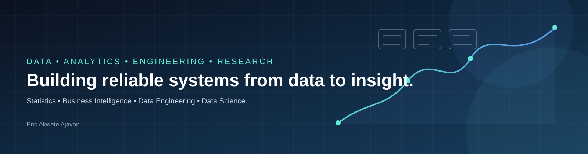

<div align="center">



<!--
<table>
<tr>
<td width="22%" align="center">

</td>
<td width="78%" align="left">

# Eric Akwete Ajavon

### Data Specialist | Analytics • Engineering • BI • Statistics • Data Science & Research

I am a multidisciplinary **Data Specialist** with a background in **Statistics** and hands-on experience across the data lifecycle, from data quality, cleaning and transformation to statistical analysis, business intelligence, automation, and reproducible analytical workflows.

My work combines **data analytics, data engineering, statistical methods, business intelligence, and research** to turn complex datasets into reliable information and actionable insight.

</td>
</tr>
</table>

-->

# Eric Akwete Ajavon

### Data Specialist | Analytics • Engineering • BI • Statistics • Data Science & Research

I am a multidisciplinary **Data Specialist** with a background in **Statistics** and hands-on experience across the data lifecycle, from data quality, cleaning and transformation to statistical analysis, business intelligence, automation, and reproducible analytical workflows.

My work combines **data analytics, data engineering, statistical methods, business intelligence, and research** to turn complex datasets into reliable information and actionable insight.

<a href="https://www.linkedin.com/in/eric-aajavon">LinkedIn</a> •
<a href="https://github.com/EricAjavon">GitHub</a> •
<a href="https://www.datascienceportfol.io/EAA">Portfolio</a> •
<a href="mailto:ea.ajavon@gmail.com">Email</a>

<!--
<a href="https://www.linkedin.com/in/eric-aajavon">
  
</a>
<a href="https://github.com/EricAjavon">
  
</a>
<a href="https://www.datascienceportfol.io/EAA">
  
</a>
<a href="mailto:ea.ajavon@gmail.com">
  
</a>
-->

</div>

---

## 👨🏾‍💻 About Me

I am a **Statistics graduate and data professional** focused on building reliable, reproducible and decision-ready data solutions.

My professional experience includes working with **large-scale agricultural and socio-economic survey datasets**, where I have contributed to data quality assurance, data management, statistical analysis, survey-weighted estimation, reporting and analytical automation.

Alongside professional work, I build portfolio projects covering **business intelligence, SQL analytics, data engineering, statistical modeling and Python-based automation**.

I am particularly interested in roles where data needs to move reliably through the full analytical lifecycle:

**Data → Quality → Engineering → Analysis → Modeling → Visualization → Evidence → Decision-making**

---

## 🧭 What I Work Across

<table>
<tr>
<td width="25%" valign="top">

### 📊 Data Analytics
- Data cleaning & transformation
- Exploratory data analysis
- KPI development
- Statistical analysis
- Data visualization
- Analytical reporting

</td>
<td width="25%" valign="top">

### ⚙️ Data Engineering
- ETL / ELT workflows
- Data preparation
- Pipeline automation
- Data quality systems
- Reproducible workflows
- Database-oriented analytics

</td>
<td width="25%" valign="top">

### 📈 Business Intelligence
- Power BI
- DAX
- Power Query
- Excel analytics
- Data modeling
- Interactive dashboards

</td>
<td width="25%" valign="top">

### 🔬 Statistics & Research
- Survey data analysis
- Complex survey designs
- Weighting & estimation
- Statistical modeling
- Applied research
- Reproducible analysis

</td>
</tr>
</table>

---

# 🛠️ Technical Skills

## Core Skills

These are the technologies and analytical capabilities I have developed through professional and project-based work.

<p>


</p>

**Core analytical capabilities**

- Data cleaning, validation and quality assurance
- Statistical analysis and survey-weighted estimation
- Data transformation and preparation
- Data visualization and dashboard development
- Business intelligence and KPI reporting
- Survey data systems and multi-level datasets
- Statistical programming and reproducible workflows
- Automated data processing

---

## Working Knowledge

<p>


</p>

- ETL / ELT concepts
- Data modeling
- Relational databases
- Analytical workflow automation
- Version control
- Notebook-based analysis

---

## Currently Learning

### 🤖 Advanced Machine Learning & Deep Learning

I am currently expanding my data science capabilities through deeper work in:

- Machine learning algorithms
- Model evaluation and validation
- Feature engineering
- Ensemble methods
- Neural networks
- Deep learning architectures
- Practical model deployment workflows

---

# 🚀 Featured Projects

<table>
<tr>
<td width="50%" valign="top">

## 📊 AdventureWorks Sales Analytics

**Excel • Power Query • Power BI • DAX • Data Modeling**

An end-to-end sales analytics project built from the AdventureWorks dataset.

**Focus areas**
- Data transformation with Power Query
- Sales and profitability analysis
- Dimensional data modeling
- DAX measures and KPIs
- Customer and product analysis
- Interactive Power BI reporting
- Business-oriented dashboard design

<!-- <a href="https://github.com/EricAjavon">View project →</a> -->
<a href="https://github.com/EricAjavon/AdventureWorks-Sales-Analytics.git">View project →</a>

</td>

<td width="50%" valign="top">

## 🗄️ Advanced SQL & Power BI Analytics

**MySQL • SQL • Power BI • Data Analysis**

A practical analytics workflow covering database loading, SQL querying and business intelligence reporting.

**Focus areas**
- Relational data loading
- SQL analysis
- Aggregation and filtering
- Business metrics
- Power BI visualization
- Analytical documentation

<a href="https://github.com/EricAjavon">View project →</a>

</td>
</tr>

<tr>
<td width="50%" valign="top">

## 🌾 CorePME Agricultural Survey Analytics

**Stata • Survey Statistics • Data Quality • Statistical Analysis**

A professional survey-data analytics workflow involving large-scale agricultural datasets.

**Focus areas**
- Household, parcel, plot, crop and livestock data
- Data quality and validation
- Survey weights
- Complex survey designs
- Statistical indicators
- Regional and national reporting
- Reproducible statistical workflows

*Selected professional work is represented through methodology and anonymized examples where institutional data cannot be published.*

</td>

<td width="50%" valign="top">

## ⚙️ Python / Stata / R Data Processing Automation

**Python • Stata • R • Automation**

Automated analytical workflows designed to reduce repetitive processing and improve consistency across statistical data preparation tasks.

**Focus areas**
- Automated data preparation
- Cross-language workflows
- Validation routines
- Script orchestration
- Reproducibility
- Reduction of manual processing

<a href="https://github.com/EricAjavon">View repositories →</a>

</td>
</tr>
</table>

---

# 🔬 Research & Professional Interests

My interests sit at the intersection of **data, statistics, technology and applied research**.

- 📊 Statistical analysis & survey methodology
- 🌾 Agricultural and socio-economic statistics
- 🔎 Data quality and statistical data systems
- 🧮 Applied statistics & econometrics
- 📈 Business intelligence & decision analytics
- ⚙️ Data engineering & reproducible pipelines
- 🤖 Machine learning & data science
- 🌍 Development economics & evidence-based policy
- 🧪 Impact evaluation & applied research
- 🔁 Reproducible research and analytical systems

---

# 💼 Professional Experience

### Data Quality & Statistical Analysis
**Ghana Statistical Service & Ministry of Food and Agriculture (MoFA)**  
`2025 – Present`

Working with large-scale agricultural survey data across household, parcel, plot, crop and livestock modules.

**Key areas of work**
- Data cleaning, management and quality assurance
- Production of statistical indicators and analytical tables
- Survey-weighted statistical analysis
- Multi-level dataset management
- Data validation and inconsistency resolution
- Automated Stata/Python analytical workflows
- Regional and national statistical reporting

### Data Quality Monitor & Analyst
**Ghana Statistical Service — Ghana Core Agriculture++**  
`2024 – 2025`

- Data quality assurance using Stata, R and Python
- Automated monitoring and reporting workflows
- Dashboard development for field and survey monitoring
- Investigation and resolution of data inconsistencies
- Support for large-scale agricultural data processing

---

# 🎓 Education & Certifications

### 🎓 Bachelor of Science — Statistics
**Kwame Nkrumah University of Science and Technology (KNUST)**  
`2017 – 2021`

### Professional Development

- **AI Literacy** — IBM SkillsBuild
- **Associate Data Analyst** — DataCamp
- **Data Engineering** — Trestle Academy
- **AI Career Essentials** — ALX
- **Data Analytics** — Explore AI Academy
- **Statistical Analysis** — Programming Hub
- **Fundamentals of Data Science in Precision Medicine and Cloud Computing** — Stanford University short course

> Certifications and professional learning are continuously expanding alongside practical project work.

---

# 📈 GitHub Analytics

[](https://github.com/stats-organization/github-stats-extended) 

<!--
<div align="center">


<div align="center">


</div>
-->
---

# 🧩 How I Approach Data

I think about data work as a complete system rather than isolated analysis.

```text
                    ┌──────────────────┐
                    │   Data Sources   │
                    └────────┬─────────┘
                             │
                             ▼
                    ┌──────────────────┐
                    │ Data Collection  │
                    │ & Data Quality   │
                    └────────┬─────────┘
                             │
                             ▼
                    ┌──────────────────┐
                    │ Transformation  │
                    │   & Engineering │
                    └────────┬─────────┘
                             │
                             ▼
               ┌─────────────┴─────────────┐
               │                           │
               ▼                           ▼
      ┌─────────────────┐        ┌─────────────────┐
      │ Statistical     │        │ BI &            │
      │ Analysis        │        │ Visualization   │
      └────────┬────────┘        └────────┬────────┘
               │                           │
               └─────────────┬─────────────┘
                             ▼
                    ┌──────────────────┐
                    │ Insight, Evidence│
                    │ & Decision-Making│
                    └──────────────────┘
```

This approach allows me to move between **technical data work and analytical interpretation**, while keeping data quality, reproducibility and documentation central to the process.

---

# 🌍 Let's Connect

I am interested in connecting with professionals and organizations working in:

**Data Analytics • Data Engineering • Business Intelligence • Statistics • Data Science • Research • Development • Technology**

<div align="center">

<a href="https://www.linkedin.com/in/eric-aajavon">

</a>

<a href="https://github.com/EricAjavon">

</a>

<a href="https://www.datascienceportfol.io/EAA">

</a>

<a href="mailto:ea.ajavon@gmail.com">

</a>

</div>

---

<div align="center">

### **Data • Statistics • Engineering • Insight**

*Building reliable data solutions that turn complex information into evidence and actionable insight.*

</div>
